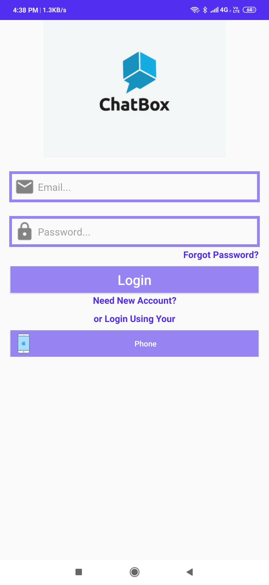
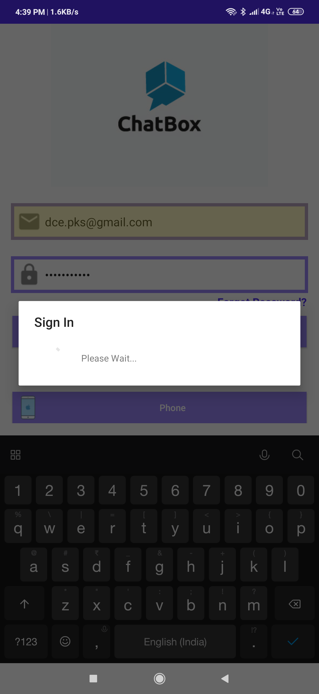
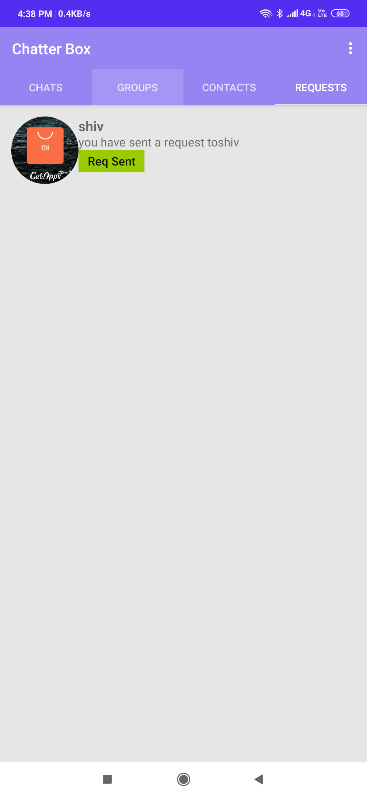
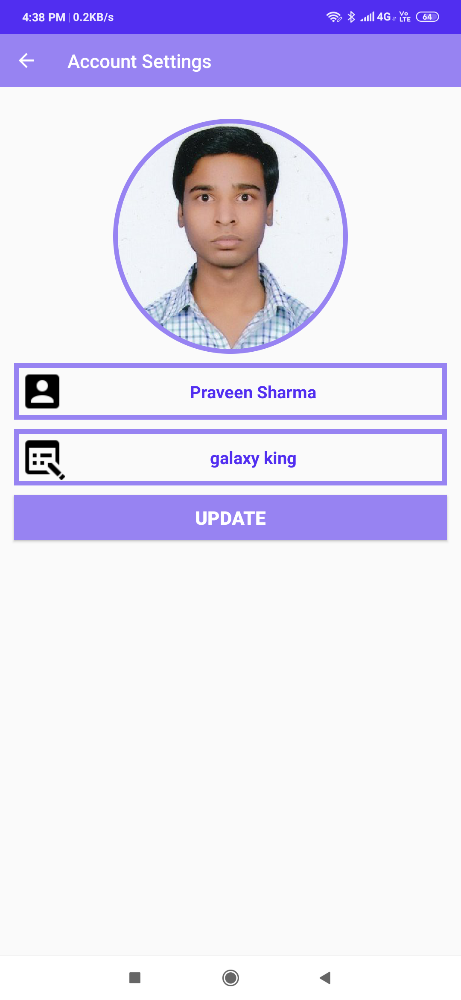

# Chat Box

This is Whatsapp Like App which support individual chatting option and group invitation 
And it also support Friend Request Option

## ScreenShot

## Getting Started

These instructions will get you a copy of the project up and running on your local machine for development and testing purposes. See deployment for notes on how to deploy the project on a live system.

### Prerequisites

Windows/Linux
Java 8 or higher

### For execute Sample Preview

1. Download Chatter Box 1.0.zip
2. Extact it.
2. Install Chatter Box 1.0.apk or Chatter Box 1.00.apk into android.
2. Register as a new User.
3. Explore features.

### Installing
1. Copy this repository.
2. Open by Andoid Studio.
2. Install all dependencies
3. Deploy it 

## Authors

* **Praveen Kumar Sharma** - *Initial work* - [Praveen Kumar Sharma](https://github.com/Praveen101997)

See also the list of [contributors](https://github.com/Praveen101997/Chat-Box/contributors) who participated in this project.

## License

